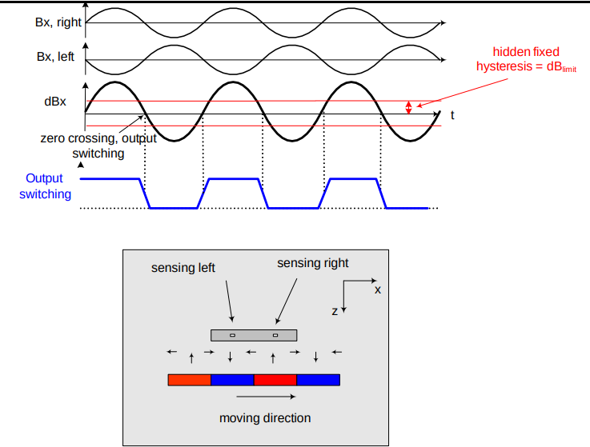
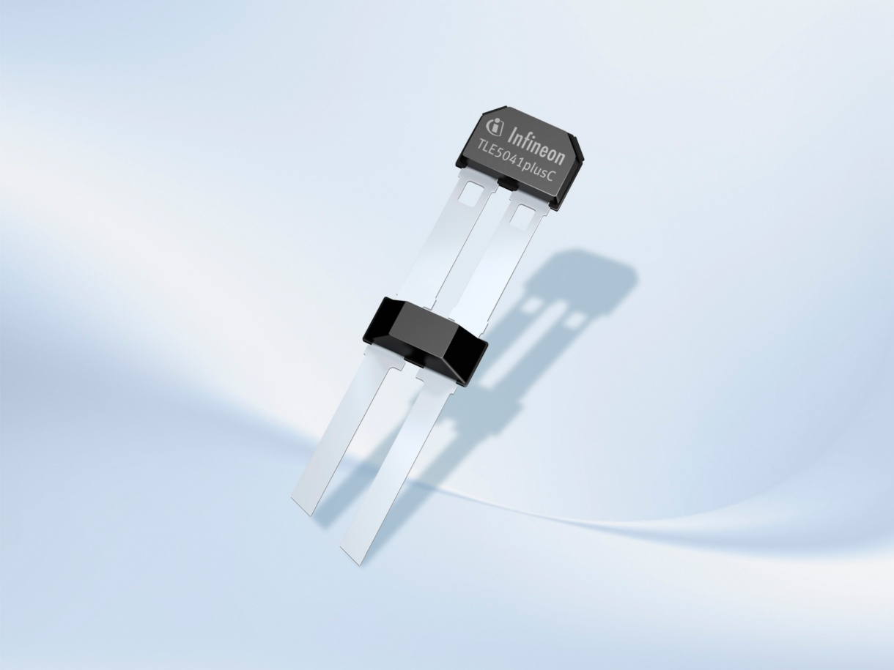
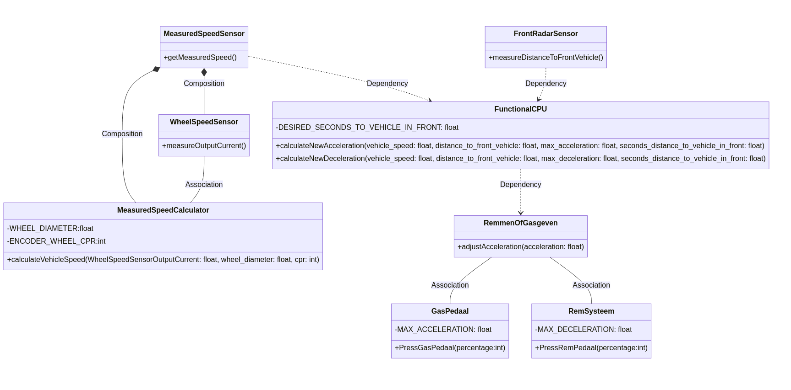
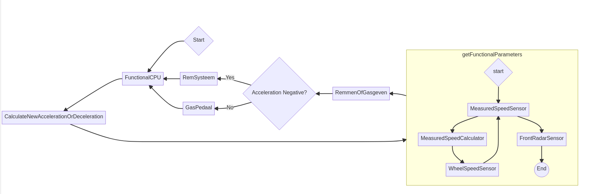

```{r setup, include=FALSE}
knitr::opts_chunk$set(echo = FALSE)
```

\setcounter{tocdepth}{3}
\tableofcontents

\newpage

#  Casusbeschrijving:
Het doel van dit project is het ontwikkelen van een adaptief cruise control systeem (ACCS) voor een voertuig. Het systeem regelt de snelheid van het voertuig en de afstand tot het voorliggende voertuig, waarbij gebruik wordt gemaakt van een Wheel speed sensor, Front Radar Sensor, Gas- en Rempedaal.

# Sensoren:
## MeasuredSpeedSensor
Omdat de snelheid van een voortuig afhangt van hoe vaak die wielen roteren en hoe groot die wielen zijn, bestaat deze abstracte sensor uit twee losse 'sub-sensors' *WheelSpeedSensor* en een *MeasuredSpeedCalculator*

### Wheel speed sensor (TLE5041plusC)
De Infineon TLE5041plusC is een magnetische hoeksensor die de wielsnelheid kan meten dankzij het Hall-effect in combinatie met een roterende as of magneet. Deze sensor is speciaal ontwikkeld voor 'harsh automotive requirements' en heeft geen andere componenten nodig dan het magnetische encoderwiel dat vastgemaakt moet worden aan de as/wiel. 

De TLE5041plusC zet de sinusoïde(sterkte magnetischveld over tijd) die ontstaat als het wiel draait, om naar een High/Low signaal via een two-wire current interface. Deze sensor weet aleen iets over de rotatiesnelheid van het encoderwiel, niets over de snelheid van het voertuig.
De frequentie van deze veranderingen kan vervolgens door bv. een microcontroller (of onze C++/Python binding, zie MeasuredSpeedCalculator) samen met informatie over de grootte van het wiel en het aantal magneten op het encoderwiel (Counts Per Revolution = CPR) omgezet worden naar een snelheid in meters per seconde.

Kenmerken:

- Werkt van 1-5000hz (magnetisch veld veranderingen per seconde)
- Kosten 5.15 euro per stuk.
- Input voltage tussen 4.5v en 20v
- Interfaced over current modulation:
    +  Supply current - output low  :  7 mA
    +  Supply current - output high : 14 mA
- Self calibrating na 5 pulses

[Link Datasheet](https://www.infineon.com/dgdl/Infineon-TLE5041PLUSC-DataSheet-v01_02-EN.pdf?fileId=5546d46265f064ff016632437f574f75)

[Link to buy on Mouser](https://nl.mouser.com/ProductDetail/Infineon-Technologies/TLE5041PLUSCAAMA1?qs=3Bi3m9r5MQasB7gUvrCn8A%3D%3D)


{width=50%} {width=30%}


### MeasuredSpeedCalculator (C++ Code)
Normaal zou dit door een apparte microcontroller, of de CPU zelf gedaan worden, maar we gaan dit als in C++ nabootsen. Hiervoor moeten we een current meter maken, zodat we het verschill in geleverde stroom van de wheelspeed sensor kunnen meten. Hieruit kunnen we de logic levels halen.
Naast dat de MeasuredSpeedCalculator C++ code de High/Low current outputs van de TLE5041plusC afleest rekent die ook met de frequentie/interval tussen deze outputs. Als dit bekent is kan de MeasuredSpeedCalculator samen met de gegeven constanten Wieldiameter en magnetic wheelencoder CPR de snelheid van het voertuig berekenen, *MeasuredSpeed*.


##  Front facing radar sensor (Bosch)
De Bosch Front Radar is een radarsensor die de afstand tot het voorliggende voertuig meet in meters . 
Deze sensor is speciaal ontwikkeld voor adaptieve cruise control systemen en biedt nauwkeurige en betrouwbare afstandsmetingen.
Hoewel de sensor over veel extra functies beschikt, zoals een breede field of view en fieter en voetgangersdetectie, is dit niet relevant voor het ACCS.
We zullen deze sensor als abstracte sensor zien die de afstand tot het voorliggende voertuig levert met de volgende kenmerken:

- Accuracy: 0,1 m
- Resolutie: 0,2 m
- Maximaal bereik: 210 m
- Update Rate: 500ms

[Link naar Bosch mobility website](https://www.bosch-mobility.com/en/solutions/sensors/front-radar-sensor/) {width=30%}


[Link naar specificaties Bosch Radar](https://www.bosch-mobility.com/media/global/products-and-services/passenger-cars-and-light-commercial-vehicles/driver-assistance-systems/multi-camera-system/front-radar-plus/onepager_front-radar_en_200608.pdf)


# Actuatoren:

## Gaspedaal
Het Gaspedaal regelt de acceleratie van het voertuig (verhoogt TrueVehicleSpeed in de Simulator)
Met interface: 0-100% waar 100 versnellen is met de maximale acceleratie constante

## Remsysteem
Het Remsysteem regelt het afremmen van het voertuig (vermindert TrueVehicleSpeed in de Simulator)
Met interface: 0-100% waar 100 remmen is met de maximale deacceleratie constante

\pagebreak

# Constanten:

- **Maximale acceleratieconstante in $m/s^2$:** een constante waarde die de maximale acceleratie van het voertuig vertegenwoordigt
- **Maximale vertragingconstante (remmen) in $m/s^2$:** een constante waarde die de maximale vertraging of vermindering van de snelheid van het voertuig vertegenwoordigt
- **Wieldiameter in meters:**  een maat die wordt gebruikt om de omtrek van het wiel (velg + band) te berekenen, wat nodig is om de snelheid van het voertuig te bepalen
- **Aantal counts per revolution van de wheelencoder voor wheel speed:**  een waarde die aangeeft hoeveel pulsen de wheelencoder genereert voor elke volledige omwenteling van het wiel; deze informatie wordt gebruikt om de snelheid van het voertuig te berekenen
- **Gewenste seconden afstand tot voorligger in S:** een constante waarde die aangeeft wat de minimale veilige tijd is die nodig is om een veilige afstand te behouden tussen het voertuig en de voorligger

De twee regelwaarden (**MeasuredSpeed** en **MeasuredAfstandTotVoorligger**) worden beïnvloed door de actuatoren (gaspedaal en remsysteem) op basis van de constanten die in het systeem zijn gedefinieerd. Door de maximale acceleratie- en vertragingconstanten kan het systeem de snelheid van het voertuig effectief realistisch(snelheid veranderen kost tijd) aanpassen om een veilige en comfortabele afstand tot het voorliggende voertuig te behouden. De informatie van de wheelencoder, in combinatie met de wieldiameter, stelt het systeem in staat om de MeasuredSpeed van het voertuig nauwkeurig te meten.


<!--
# ```{r}
# library(knitr)

# # Create a 3x4 matrix
# my_matrix <- matrix(1:12, nrow = 4, ncol = 3)

# # Convert the matrix to a data frame and add row and column names
# my_df <- as.data.frame(my_matrix)
# colnames(my_df) <- c("Hatchback", "SUV", "Ferrari" )
# rownames(my_df) <- c("Max Acceleration", "Maximale vertraging ", "Wieldiameter", "Encoder CPR")

# # Use kable() to create the table
# kable(my_df)
# ```
-->

# Simulator 

Om het hele ACCS-systeem te simuleren, moeten we verschillende externe onderdelen implementeren die de werkelijke waarden en omstandigheden in het systeem vertegenwoordigen. Deze externe componenten zijn de "echte wereld" variabelen die moeten worden gemeten en gecontroleerd door het ACCS-systeem. Hier is een overzicht van de belangrijkste externe onderdelen die nodig zijn voor de simulatie:

- **TrueVehicleSpeed** : Dit is de werkelijke snelheid van het voertuig in de simulatie. Het ACCS-systeem moet deze waarde benaderen door middel van de VehicleSpeedCalculator en de WheelSpeedSensor.
- **TrueDistanceToVoorligger** : Dit is de werkelijke afstand tot het voorliggende voertuig in de simulatie. Het ACCS-systeem moet deze waarde meten met behulp van de Front Facing Radar Sensor.
- **TrueVoorliggerSpeed** : Dit is de werkelijke snelheid van het voorliggende voertuig in de simulatie. Deze waarde beïnvloedt de TrueDistanceToVoorligger en moet op de achtergrond worden bijgehouden in de simulatie.
- **TrueVehicleAcceleration** : Dit is de werkelijke verandering (remmen of gasgeven) van TrueVehicleSpeed in de simulatie. Dit is de waarde die door de Gaspedaal/Remsysteem monads wordt aangepast.

Door deze externe componenten in de simulatie te implementeren, kan het ACCS-systeem worden getest en gevalideerd onder realistische omstandigheden. Het systeem moet in staat zijn om deze "echte wereld" variabelen te meten en erop te reageren om effectief de snelheid van het voertuig en de afstand tot het voorliggende voertuig te regelen.


\newpage

# Groepen Constants voor Simulator 
Voor de simulatie gebruiken we 3 verschillende groepen constants, om zo verschillende type voertuigen te simuleren, deze zullen ook worden gebruikt in het Testplan.

|                    | Hatchback | SUV | Ferrari |
|:---------------------|----------:|-----------:|-------------:|
| Max Acceleration^[Berekend op basis 0-100 tijd: Mazda3, 1999 Chevrolet Tahoe, LaFerrari (6.4, 12.0, 2.4)] |         4.19 $m/s^2$|   2.23 $m/s^2$|       11.17 $m/s^2$|
| Maximale vertraging^[ Berekend op basis van  $$\frac{(-31.3 m/s)}{2*stopping distance}$$ data uit *Car And Driver 70mph stopping distance* articlelen voor Mazda 3, Tahoe, LaFerrari (166ft, 248ft, 136ft)] |         -9.68 $m/s^2$|   -6.48 $m/s^2$|      -11.82 $m/s^2$|
| Wieldiameter  in m     |         0.625m (25in) |   0.838m (33in) |      0.71m (28in) |
| Encoder CPR        |         45 |   60 |      40 |
| Seconden afstand  in S      |         3 |   2 |      1.5 |


<!--


https://www.caranddriver.com/features/a35048882/tahoe-yukon-escalade-braking-performance/
https://www.caranddriver.com/features/g29674610/best-stopping-distances-braking-tested/
https://www.auto-data.net/en/chevrolet-tahoe-gmt820-5.3-i-v8-4wd-273hp-14328
https://www.topspeed.com/ferrari-laferrari-the-best-hybrid-supercar-ever/
https://www.motortrend.com/reviews/2022-mazda-3-turbo-awd-sedan-first-test-review/#:~:text=Here%20are%20the%20numbers%3A%200,14.8%20seconds%20at%2094.6%20mph.

-->


# Architectuurschetsen:
## Hardware:

De hardware-architectuur bestaat uit de volgende componenten en verbindingen:

- WheelSpeedSensor (Infineon TLE5041plusC): Meet de veranderingen van het magnetisch veld van de wielen,de frequentie van deze veranderingen hangt af van TrueVehicleSpeed. Deze sensor stuurt deze door naar de MeasuredSpeedCalculator.
- MeasuredSpeedCalculator (C++ code met python Bindings.): Berekent de MeasuredSpeed op basis van de WheelSpeedSensor, Wieldiameter, CPR van het encoderwiel. Stuurt de MeasuredSpeed door naar de CPU.
- Front Radar Sensor (Bosch Front Radar): Meet de afstand tot het voorliggende voertuig en stuurt deze informatie door naar de CPU.
- CPU: Verwerkt de gegevens van de Wheel Speed Sensor en Front Radar Sensor, en stuurt commando's naar de actuatoren.
- Gaspedaal: Ontvangt commando's van de CPU om de acceleratie van het voertuig te regelen.
- Remsysteem: Ontvangt commando's van de CPU om het afremmen van het voertuig te regelen.

\pagebreak

### Diagram
```{r,echo=FALSE, results = "asis",fig.cap = "Hardware Diagram showing how the sensors and actuators are connected to each other"}
library(DiagrammeR)
library(networkD3)
library(webshot2)

g  <- mermaid("
graph TB 
A[WheelSpeedSensor- TLE5041plusC]
B[MeasuredSpeedCalculator - C++ code]
F[FrontRadarSensor - Bosch]
C((CPU))
D[Gaspedaal]
E[Remsysteem]
    subgraph Sensors
        subgraph MeasuredSpeedSensor 
        A ==>|CurrentModulation| B
    end
    F
    end
    B ==> C
    F ==> C
        C --> D
        C --> E
    subgraph Actuators
    D
    E
    end
    ", height = '200%', width = '140%')

saveNetwork(g, "g.html")

webshot("g.html", file = "g.png") 
```

- De WheelSpeedSensor zit via 12v current Modulation interface verbonden met de MeasuredSpeedCalculator.
- De Front Radar Sensor en de MeasuredSpeedCalculator zijn verbonden met de CPU via een bekabelde interface.
- De CPU communiceert via een bekabelde interface met de Gaspedaal en Remsysteem actuatoren om de snelheid van het voertuig te regelen om zo een veilige afstand tot het voorliggende voertuig te behouden.

\pagebreak


## Software:
De software bestaat uit verschillende klassen die de sensoren, actuatoren, CPU en algoritmes voor ACCS bevatten. De interfaces tussen de klassen zijn gedefinieerd om gegevens uit te wisselen en de algehele werking van het systeem te coördineren. Het regelsysteem is geïmplementeerd volgens het Functional Reactive Programming principe en is geschreven in Python, met gebruik van de C++-bibliotheek voor de SpeedSensor.


## Verdere abstractie voor gaspedaal/remsysteem
Waarchijnlijk is het voor het implementeren makkelijker om acceleratie/deacceleratie als een functie te zien, waar deacceleratie negative acceleratie is.
Er komt dan nog tussen de CPU en het remsysteem en gaspedaal ongeveer het volgende stukje code (abstraction interface achtig onderdeel). 

```haskell

RemmenOfGasgeven :: (Num a, Ord a) => (a -> b) -> (a -> b) -> a -> b
RemmenOfGasgeven rempedaal gaspedaal a
  | a <= 0    = rempedaal a
  | otherwise = gaspedaal a

```

In dit geval zit de logica/berekening van *Acceleration in $m/s^2$* naar *GaspedaalPercentage int:(range 0,100)* nog in de  `gaspedaal a ` functie.


### Diagram
{width=100%}

```{r,echo=FALSE, results = "asis"}
library(DiagrammeR)
library(networkD3)
library(webshot2)


#  ```mermaid
# classDiagram
#     class WheelSpeedSensor {
#         +measureOutputCurrent(): float
#     }
#     class MeasuredSpeedCalculator {
# 				-WHEEL_DIAMETER:float
# 				-ENCODER_WHEEL_CPR:int
#         +calculateVehicleSpeed(WheelSpeedSensorOutputCurrent: float, wheel_diameter: float, cpr: int): float
#     }
#     class MeasuredSpeedSensor {
#         +getMeasuredSpeed(): float
#     }
#     class FrontRadarSensor {
#         +measureDistanceToFrontVehicle(): float
#     }
#     class GasPedaal {
#         +PressGasPedaal(percentage:int): void
#         -MAX_ACCELERATION: float
#     }
#     class RemSysteem {
#         +PressRemPedaal(percentage:int): void
#         -MAX_DECELERATION: float
#     }
#     class FunctionalCPU {
#         +calculateNewAcceleration(vehicle_speed: float, distance_to_front_vehicle: float, max_acceleration: float, seconds_distance_to_vehicle_in_front: float): float
#         +calculateNewDeceleration(vehicle_speed: float, distance_to_front_vehicle: float, max_deceleration: float, seconds_distance_to_vehicle_in_front: float): float
#         -DESIRED_SECONDS_TO_VEHICLE_IN_FRONT: float
#     }
#     class RemmenOfGasgeven {
#         +adjustAcceleration(acceleration: float): void
#     }

#     MeasuredSpeedSensor *-- WheelSpeedSensor : Composition
#     MeasuredSpeedSensor *-- MeasuredSpeedCalculator : Composition
#     WheelSpeedSensor -- MeasuredSpeedCalculator : Association
#     MeasuredSpeedSensor ..> FunctionalCPU : Dependency
#     FrontRadarSensor ..> FunctionalCPU : Dependency
#     FunctionalCPU ..> RemmenOfGasgeven : Dependency
#     RemmenOfGasgeven -- GasPedaal : Association
#     RemmenOfGasgeven -- RemSysteem : Association
#    ", height = '100%', width = '100%')

# saveNetwork(h, "h.html")

#webshot("h.html", file = "h.png") 

```


1. **WheelSpeedSensor** : Deze klasse is verantwoordelijk voor het meten van de wielsnelheid(eigenlijk aleen Hall Effect). Het bevat een methode `measureOutputCurrent()` die de uitgangsstroom van de sensor meet.
2. **MeasuredSpeedCalculator** : Deze klasse ontvangt de uitgangsstroom van de WheelSpeedSensor en berekent de voertuigsnelheid op basis van de wielsnelheid en andere constanten zoals WHEEL_DIAMETER en ENCODER_WHEEL_CPR. De berekening gebeurt in de methode `calculateVehicleSpeed()`.
3. **MeasuredSpeedSensor** : Deze klasse is verantwoordelijk voor het verkrijgen van de gemeten snelheid van het voertuig. Het bevat een methode `getMeasuredSpeed()` die de gemeten voertuigsnelheid retourneert.
4. **FrontRadarSensor** : Deze klasse meet de afstand tot het voorliggende voertuig. Deze waarde wordt vervolgens doorgegeven aan de FunctionalCPU klasse.
5. **GasPedaal** : Deze klasse regelt de acceleratie van het voertuig. Het ontvangt de berekende acceleratie van de RemmenOfGasgeven klasse en past deze toe op het voertuig. De klasse heeft een private variabele MAX_ACCELERATION, die de maximale acceleratieconstante in m/s² bevat.
6. **RemSysteem** : Deze klasse regelt het afremmen van het voertuig. Het ontvangt de berekende vertraging van de RemmenOfGasgeven klasse en past deze toe op het voertuig. De klasse heeft een private variabele MAX_DECELERATION, die de maximale vertragingconstante (remmen) in m/s² bevat.
7. **FunctionalCPU** : Deze klasse bevat twee methoden, `calculateNewAcceleration()` en `calculateNewDeceleration()`. Deze methoden nemen respectievelijk de voertuigsnelheid, afstand tot het voorliggende voertuig, maximale acceleratie/deceleratie en seconden afstand tot het voorliggende voertuig als parameters en berekenen de nieuwe acceleratie of vertraging, om zo dichter bij de gewenste afstand tot de voorligger te komen. De klasse heeft een private variabele DESIRED_SECONDS_TO_VEHICLE_IN_FRONT, die de minimale veilige tijd aangeeft om een veilige afstand te behouden tussen het voertuig en het voorliggende voertuig.
8. **RemmenOfGasgeven** : Deze klasse is verantwoordelijk voor het aanpassen van de acceleratie van het voertuig op basis van de berekende waarden van de FunctionalCPU klasse. Het bevat een methode `adjustAcceleration()` die de acceleratie aanpast.

De relaties tussen de verschillende klassen: 

- MeasuredSpeedSensor heeft een compositierelatie met WheelSpeedSensor en MeasuredSpeedCalculator. (Bestaat uit deze Twee Subsensors)
- WheelSpeedSensor heeft een associatierelatie met MeasuredSpeedCalculator. (de Calculator moet elke keer de measureOutputCurrent() method aanroepen)
- MeasuredSpeedSensor, FrontRadarSensor en FunctionalCPU hebben dependancyrelaties. (dependancyrelaties zijn mischien niet helemaal 'correct' maar omdat dit functioneele stukken code zijn, weergeeft deze relatie de functionele inputs) 
- RemmenOfGasgeven heeft associatierelaties met GasPedaal en RemSysteem. (Het GasPedaal en RemSysteem moeten opvragen wat de dubbelzinnige acceleration waarde betekend in de RemmenOfGasgeven (positief of negatief))

## Flowchart

### Diagram


```{r,echo=FALSE, results = "asis"}
# flowchart RL
# 	subgraph getFunctionalParameters
#    B{start} --> MeasuredSpeedSensor
#   	MeasuredSpeedSensor --> MeasuredSpeedCalculator
#   	MeasuredSpeedCalculator --> WheelSpeedSensor
#   	WheelSpeedSensor --> MeasuredSpeedSensor
#   MeasuredSpeedSensor --> FrontRadarSensor
#   FrontRadarSensor --> C((End))
#   end
  
# A{Start} --> FunctionalCPU
# FunctionalCPU --> CalculateNewAccelerationOrDeceleration
#     CalculateNewAccelerationOrDeceleration --> getFunctionalParameters
#   getFunctionalParameters --> RemmenOfGasgeven 
#   RemmenOfGasgeven --> AccelerationDecision{Acceleration Negative?}
#   AccelerationDecision -- Yes --> RemSysteem
#   AccelerationDecision -- No --> GasPedaal
#   RemSysteem --> FunctionalCPU
#   GasPedaal --> FunctionalCPU
```


# Testplan:
Het testplan geeft eerst uitleg over een Unit , Integratie en Systeem test, de test procedure en de motivatie warom we deze tests doen. Vervolgens is er een IEEE829 Testplan opgesteld waarin deze 3 tests worden gebruikt.


## Unit Test: MeasuredSpeedCalculator

### Motivatie
De MeasuredSpeedCalculator is een cruciaal onderdeel van het systeem, aangezien het de snelheid van het voertuig probeert
te berekenen op basis van de input van de WheelSpeedSensor. 
 Een nauwkeurige snelheidsberekening is essentieel voor het ACC systeem, waardoor het op een veilige afstand tot het voorliggende voertuig kan blijven. 
  Als de MeasuredSpeedCalculator onjuiste snelheden berekent, heeft dit via de CPU invloed op het op het GasPedaal en Remsysteem. Fouten of ongewenst gedrag in deze 2 actuatoren
   kan dit leiden tot onveilige situaties en mogelijk ongevallen. Het testen van deze component is daarom noodzakelijk
   om te waarborgen dat het systeem goed functioneert en om de veiligheid te garanderen.

     
### Testprocedure 

Testen of de MeasuredSpeedCalculator de snelheid van het voertuig correct berekent op basis van verschillende inputwaarden(Hatchback,SUV,Ferrari) van de WheelSpeedSensor, Wieldiameter en CPR van het encoderwiel.

1. Bereid testscenario's voor met verschillende inputwaarden voor de WheelSpeedSensor, Wieldiameter en CPR van het encoderwiel. Gebruik realistische waarden die overeenkomen met verschillende voertuigtypen (bijv. Hatchback, SUV, Ferrari).
2. Voer de testscenario's uit met behulp van de Simulator, en leg zowel de berekende snelheden, als de TrueVehicleSpeed uit de Simulator vast.
3. Vergelijk de berekende snelheden met de TrueVehicleSpeed, rekening houdend met de variabelen van de verschillende soorten autos uit de testscenario's. 
4. Controleer of de berekende snelheden binnen een acceptabele foutmarge(+- 2.0%) van de verwachte snelheden vallen. Als dit niet het geval is, onderzoek dan de oorzaak en pas de implementatie van de MeasuredSpeedCalculator (of WheelSpeedSensor) aan indien nodig.
5. Herhaal de testprocedure totdat de berekende snelheden consistent nauwkeurig(i.e. binnen de foutmarge) zijn voor alle testscenario's.


Deze testprocedure is ontworpen met verschillende belangrijke aspecten in gedachten om de nauwkeurigheid van de snelheidsberekeningen te waarborgen en de veiligheid van het systeem te garanderen:

- Realistische waarden worden gebruikt voor de inputvariabelen om de prestaties van het systeem in de praktijk te beoordelen.
- Het vastleggen van zowel de berekende snelheden als de TrueVehicleSpeed stelt ons in staat om objectief de nauwkeurigheid van de berekeningen te beoordelen.
- Door een kleine foutmarge te gebruiken, wordt rekening gehouden met de beperkingen van floating-point precisie en kleine nauwkeurigheidsfouten in de sensors.
- Het herhalen van de testprocedure zorgt voor betrouwbaarheid en verkleint de kans op onveilige situaties of ongevallen.

Door deze testprocedure te volgen, kunnen we de nauwkeurigheid van de snelheidsberekening garanderen en voorkomen dat ongewenst gedrag van het GasPedaal en Remsysteem leidt tot onveilige situaties en mogelijk ongevallen.

\pagebreak

## Integratietest: WheelSpeedSensor's industiele 12V Current Modulation interface 

### Motivatie
De communicatie tussen de WheelSpeedSensor en de MeasuredSpeedCalculator is noodzakelijk voor het berekenen van de snelheidsberekeningen.
Als deze interface niet goed werkt, levert dit mischien onjuiste data voor de MeasuredSpeedCalculator. Dit zal problemen opleveren voor de hierboven genoemde Unit Test.
Het testen van de interface helpt om te waarborgen dat het systeem correct functioneert en draagt bij aan de veiligheid.


Test: Testen of de 12V Current Modulation-interface de High/Low current outputs van de WheelSpeedSensor correct doorstuurt naar de MeasuredSpeedCalculator en of de MeasuredSpeedCalculator deze signalen correct interpreteert om de snelheid van het voertuig te berekenen.

### Testprocedure

- Zorg ervoor dat de WheelSpeedSensor en de MeasuredSpeedCalculator correct zijn aangesloten via de 12V Current Modulation-interface. (In ons geval is dit de C++/Python Bindings en de communicatie hier tussen)
- Simuleer verschillende rotatiesnelheden van het wiel, met de WheelSpeedSensor daar op aangesloten.
- Monitor de High/Low current outputs die door de WheelSpeedSensor worden gegenereerd op basis van de rotatiesnelheid van het wiel en verifieer of deze correct worden doorgegeven via de 12V Current Modulation-interface.
- Controleer of de MeasuredSpeedCalculator de ontvangen High/Low current outputs correct interpreteert en of de berekende snelheid overeenkomt met de werkelijke snelheid van het wiel (rekening houdend met de Wieldiameter en de CPR van het encoderwiel).
- Voer deze test uit voor verschillende rotatiesnelheden van het wiel om te verifiëren of de interface en de MeasuredSpeedCalculator onder verschillende omstandigheden correct functionert.

De testprocedure controleert of de 12V Current Modulation-interface correct werkt en of de MeasuredSpeedCalculator de signalen nauwkeurig interpreteert. Hierdoor wordt de nauwkeurige snelheidsberekening gegarandeerd en de veiligheid van het systeem gewaarborgd. Het testen van verschillende rotatiesnelheden zorgt ervoor dat het systeem onder uiteenlopende omstandigheden correct functioneert.


\pagebreak

## Systeemtest: ACCS houdt Veilige afstand in verschillende verkeersscenarios


### Motivatie

Het belangrijkste doel(kwaliteitscriterium) van het ACCS is het behouden van een veilige afstand tot het voorliggende voertuig. Het testen van het systeem in verschillende verkeerssituaties en snelheden helpt om te waarborgen dat het systeem correct functioneert, betrouwbaar en veilig is, en voldoet aan de gestelde kwaliteitseisen.

### Testprocedure

1. Bereid verschillende verkeerssituaties en snelheden voor, die het ACCS-systeem zou kunnen tegenkomen in real-world scenario's (bijv. stadsverkeer, snelwegverkeer, file, acceleratie en deceleratie, enz.). En implementeer  deze scenarios in de Simulator.
3. Voer de test in de simulator voor verschillende soorte Constantes (Hatchback,SUV,Ferrari), voor elk van de voorbereide verkeersscenario's.
4. Monitor en registreer de volgende waardes tijdens elk scenario:
    - Afstand tot voorligger in meters
    - MeasuredSpeed
    - Afstand tot voorligger in seconden met de huidige MeasuredSpeed
    - Het verschill tussen deze laatste waarde, en de constante 'gewenste afstand tot voorligger in secondes'
5. Analyseer de resultaten om te bepalen of het ACCS-systeem de ingestelde veilige afstand tot het voorliggende voertuig in alle situaties heeft behouden.
    - **Als de afstand tot voorligger in meters 0 of negatief is, betekend dit dat er een een botsing is geweest, dit is per definitie dus geen 'veilige afstand'**

Als de verkeersscenarios divers genoeg zijn kijkt deze systeemtest naar: 

- Of het systeem de juiste afstand tot de voorligger handhaaft op basis van de gedefinieerde veilige tijd (S) en de huidige snelheid van het voertuig.
- Of het systeem correct reageert op veranderingen in de snelheid van het voorliggende voertuig en de afstand tussen de voertuigen aanpast om een veilige afstand te handhaven.
- Of het systeem tijdig reageert op plotselinge veranderingen in de snelheid van het voorliggende voertuig, zoals plotseling remmen.

De testprocedure controleert grondig of het ACCS-systeem effectief is in het behouden van een veilige afstand tot het voorliggende voertuig in verschillende verkeerssituaties en snelheden. 
Door het uitvoeren van deze tests wordt de correcte werking van de individuele componenten, de communicatie tussen de componenten en de algehele systeemprestaties gevalideerd. 


\pagebreak

# Adaptive Cruise Control Systeem (ACCS) IEEE 829 Testplan
Op basis van [https://www.mammoth-ai.com/how-to-write-a-test-plan-with-the-ieee-829-standard/](https://www.mammoth-ai.com/how-to-write-a-test-plan-with-the-ieee-829-standard/)

####  Test plan identifier:
`ACCS Testplan v1.0`

####  Introduction:
Dit testplan beschrijft de testprocedures en teststrategie voor het Adaptive Cruise Control Systeem (ACCS), dat de snelheid en afstand tot het voorliggende voertuig regelt met behulp van wheel speed sensors, front facing radar sensors, gaspedaal en remsysteem.

####  Test items:

1. Unit Test: MeasuredSpeedCalculator
2. Integratietest: Interface 12V Current Modulation tussen de WheelSpeedSensor en MeasuredSpeedSensor
3. Systeemtest: Algemene werking van het ACCS, inclusief de interactie tussen alle componenten

####  Features to be tested:

De te testen functies zijn:

- Nauwkeurigheid van de berekende snelheid in de MeasuredSpeedCalculator
- Correcte werking van de 12V Current Modulation interface tussen de WheelSpeedSensor en MeasuredSpeedSensor
- Algemene werking van het ACCS, inclusief de interactie tussen alle componenten

####  Features not to be tested:

- Niet-ACCS gerelateerde voertuigsystemen
- Interactie tussen ACCS en bestuurder
- Hardware- en software compatibiliteit met andere voertuigsystemen

####  Item pass/fail criteria:
De volgende criteria worden gebruikt om te bepalen of een testitem slaagt of faalt:

1. Unit Test: MeasuredSpeedCalculator: De berekende snelheid ligt binnen de ± 3% foutmarge van de werkelijke snelheid.
2. Integratietest: Interface 12V Current Modulation: De interface functioneert correct en zorgt voor een stabiele en nauwkeurige overdracht van snelheidsinformatie tussen de WheelSpeedSensor en MeasuredSpeedSensor.
3. Systeemtest: Algemene werking van het ACCS: Het ACCS functioneert correct en zorgt voor een veilige en comfortabele rit onder verschillende verkeersomstandigheden. Er zal per verkeersscenarios worden bijgehouden of er een botsing plaats vindt.


####  Suspension criteria and resumption requirements:
Testen worden opgeschort als een van de volgende situaties zich voordoet:

1. Unit Test: MeasuredSpeedCalculator: Er wordt een fout ontdekt in de berekening van de snelheid die de nauwkeurigheid van de meting buiten de ± 3% foutmarge brengt, zelf met aanpassingen van de bijbehoorende code.
2. Integratietest: Interface 12V Current Modulation: Er treden problemen op in de interface die leiden tot onjuiste of inconsistente overdracht van snelheidsinformatie tussen de WheelSpeedSensor en MeasuredSpeedSensor.
3. Systeemtest: Algemene werking van het ACCS: er is geen enkel verkeersscenarios waar er geen botsing plaats vindt.

Hervatting van de tests zal plaatsvinden zodra de problemen zijn opgelost.


####  Test deliverables:
De volgende test deliverables zullen worden opgeleverd:

- Testplan
- Test cases en testscripts
- Test dataverzameling en analyse
- Testrapport

####  Testing tasks:
De tests zullen de volgende taken omvatten:

- Voorbereiding van simulator en schrijven van verkeersscenarioss voor de verschillende test cases
- Uitvoeren van unit tests, integratietests en systeemtests
- Analyseren van testresultaten
- Opstellen van testrapport

####  Environmental needs:
De testomgeving omvat een simulator met de ACCS-componenten geïmplementeerd en operationeel. De simulator moet de volgende externe onderdelen bevatten om realistische testomstandigheden te creëren:

- TrueVehicleSpeed
- TrueDistanceToVoorligger
- TrueVoorliggerSpeed
- TrueVehicleAcceleration
Ook zal er er voor de simulator verschillende verkeersscenarios worden geschreven, zoals beschreven in de Systeemtest.

####  Responsibilities:
Het testteam is verantwoordelijk voor het plannen, uitvoeren en analyseren van de tests en het opstellen van het testrapport. Het ontwikkelteam is verantwoordelijk voor het oplossen van eventuele problemen die tijdens de tests worden geïdentificeerd.
Maar aangezien ATP een individueel vak is bestaat het *testteam* en het *ontwikkelteam* uit dezelfde persoon, namelijk ik zelf.

####  Staffing and training needs:
De needs zijn een beetje irrelevant gezien dat ATP een individueel vak is, we moeten testen met de enige testengineer die we hebben, ongeacht zijn traning niveau.

#### Schedule:
De tests zullen volgens het volgende schema worden uitgevoerd:

- Week 0: op 11 April wordt het Project en Testplan worden ingeleverd op canvas.
- Week 1-3: Implementern van het ACCS systeem en de simulator.
- Week 4: Uitvoeren van de Unit tests en integratietests
- Week 5: Uitvoeren van Systeemtest
- Week 6: Analyse van testresultaten en opstellen van testrapport

#### Risks and contingencies:
Mogelijke testrisico's zijn onder meer:

- Onnauwkeurige of onbetrouwbare simulatieomgeving: Als de simulator niet in staat is om realistische testomstandigheden nauwkeurig te reproduceren, kan dit leiden tot onbetrouwbare testresultaten. Om dit risico te beperken, moet de simulator zorgvuldig worden gevalideerd en gecontroleerd om ervoor te zorgen dat deze de werkelijke omstandigheden en waarden correct weergeeft.
- Beperkte testscenario's in de simulator: Als de simulator slechts een beperkte set van testscenario's kan uitvoeren, bestaat het risico dat het ACCS-systeem niet volledig wordt getest onder alle mogelijke verkeersomstandigheden en snelheden. Om dit risico te beheersen, moeten zoveel mogelijk relevante testscenario's in de simulator worden geïmplementeerd en, indien nodig, moet overwogen worden om aanvullende tests uit te voeren in een fysieke testomgeving.

In geval van problemen zullen er geschikte maatregelen worden genomen om de impact op het testschema te minimaliseren en de kwaliteit van de testresultaten te waarborgen. Dit kan onder andere het aanpassen van de simulatieomgeving, het uitbreiden van de testscenario's of het corrigeren van de ACCS software omvatten.

#### Approvals:
Het testplan zal ter goedkeuring worden voorgelegd aan de projectmanager (Dat ben jij, persoon die dit nu leest op canvas!), deze geeft vervolgens goedkeuring(GO) voor het testplan, en hierna zullen de tests worden uitgevoerd volgens het opgestelde schema.


# Bronnen

- https://www.infineon.com/dgdl/Infineon-TLE5041PLUSC-DataSheet-v01_02-EN.pdf?fileId=5546d46265f064ff016632437f574f75
- https://nl.mouser.com/ProductDetail/Infineon-Technologies/TLE5041PLUSCAAMA1?qs=3Bi3m9r5MQasB7gUvrCn8A%3D%3D
- https://www.bosch-mobility.com/en/solutions/sensors/front-radar-sensor/
- https://www.bosch-mobility.com/media/global/products-and-services/passenger-cars-and-light-commercial-vehicles/driver-assistance-systems/multi-camera-system/front-radar-plus/onepager_front-radar_en_200608.pdf
- https://www.caranddriver.com/features/a35048882/tahoe-yukon-escalade-braking-performance/
- https://www.caranddriver.com/features/g29674610/best-stopping-distances-braking-tested/
- https://www.auto-data.net/en/chevrolet-tahoe-gmt820-5.3-i-v8-4wd-273hp-14328
- https://www.topspeed.com/ferrari-laferrari-the-best-hybrid-supercar-ever/
- https://www.motortrend.com/reviews/2022-mazda-3-turbo-awd-sedan-first-test-review/
- https://www.mammoth-ai.com/how-to-write-a-test-plan-with-the-ieee-829-standard/