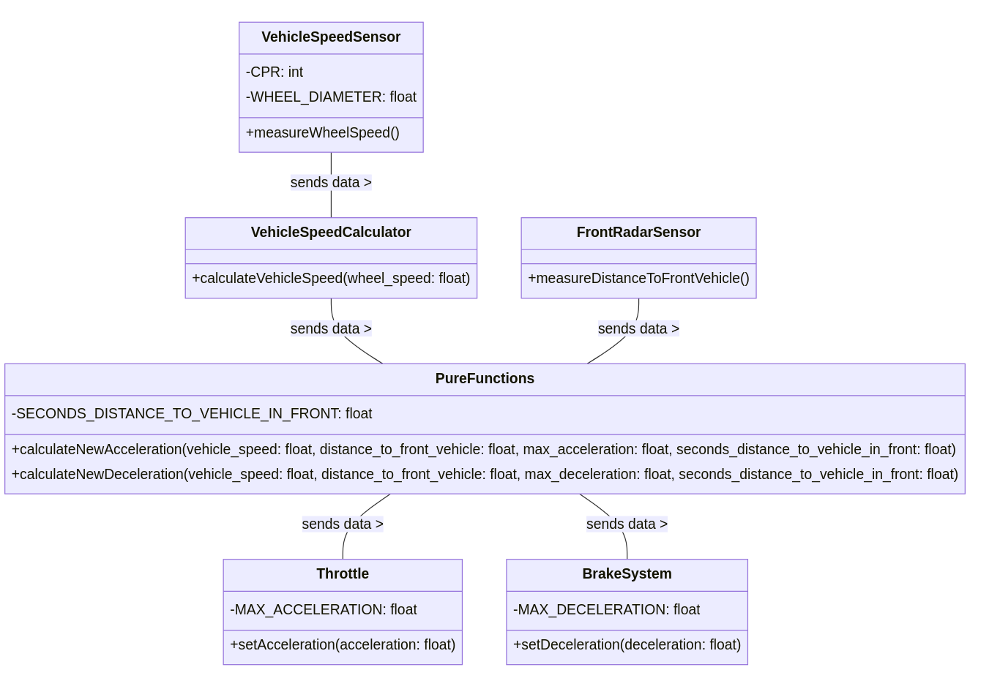

```{r setup, include=FALSE}
knitr::opts_chunk$set(echo = FALSE)
```
\newpage

#  Casusbeschrijving:
Het doel van dit project is het ontwikkelen van een adaptief cruise control systeem (ACCS) voor een voertuig. Het systeem regelt de snelheid van het voertuig en de afstand tot het voorliggende voertuig, waarbij gebruik wordt gemaakt van een Wheel speed sensor, Front Radar Sensor, Gas- en Rempedaal.

# Sensoren:
## MeasuredSpeedSensor
    Omdat de snelheid van een voortuig afhangt van hoe vaak die wielen roteren en hoe groot die wielen zijn, bestaat deze abstracte sensor uit een WheelSpeedSensor en een MeasuredSpeedCalculator

## **Wheel speed sensor**: meet de rotatie van de wielen in hz
### Hardware: Infineon TLE5041plusC
De TLE5041plusC is een magnetische hoeksensor die de wielsnelheid kan meten dankzij het Hall-effect in combinatie met een roterende as of magneet. Deze sensor is speciaal ontwikkeld voor 'harsh automotive requirements' en heeft geen andere componenten nodig dan het magnetische encoderwiel dat vastgemaakt moet worden aan de as/wiel. 

De TLE5041plusC zet de sinusoïde van de sterkte van het magnetische veld, die ontstaat als het wiel draait, om naar een High/Low signaal via een two-wire current interface. Deze sensor weet aleen iets over de rotatiesnelheid, niet over de snelheid van het voertuig.
De frequentie van deze veranderingen kan vervolgens door bv. een microcontroller (of onze C++/Python binding, zie MeasuredSpeedCalculator) samen met informatie over de grootte van het wiel en het aantal magneten op het encoderwiel (Counts Per Revolution = CPR) omgezet worden naar een snelheid in meters per seconde.

Kenmerken:
- Werkt van 1-5000hz (magnetisch veld veranderingen per seconde)
- Kosten 5.15 euro per stuk.
- Input voltage tussen 4.5v en 20v
- Interfaced over current modulation:
    +  Supply current - output low  :  7 mA
    +  Supply current - output high : 14 mA
- Self calibrating na 5 pulses

[Link Datasheet](https://www.infineon.com/dgdl/Infineon-TLE5041PLUSC-DataSheet-v01_02-EN.pdf?fileId=5546d46265f064ff016632437f574f75)
[Link buy on Mouser](https://nl.mouser.com/ProductDetail/Infineon-Technologies/TLE5041PLUSCAAMA1?qs=3Bi3m9r5MQasB7gUvrCn8A%3D%3D)


{width=30%}

{width=30%}

## MeasuredSpeedCalculator
### C++ Code
Normaal zou dit door een apparte microcontroller, of de CPU zelf gedaan wordt, maar dit word in C++ nageboost, we moeten een current meter maken, zodat we het verschill in geleverde stroom van de wheelspeed sensor kunnen meten, en hieruit de logic levels halen.
C++ code die de High/Low current outputs van de TLE5041plusC afleest, de frequentie/interval tussen deze outputs opmeet, en samen met de gegeven constanten Wieldiameter en magnetic wheelencoder CPR kan de MeasuredSpeedCalculator de snelheid van het voertuig berekenen.

\newpage


##  **Front facing radar sensor**: *meet de afstand tot het voorliggende voertuig in meters
De Bosch Front Radar is een radarsensor die de afstand tot het voorliggende voertuig meet. 
Deze sensor is speciaal ontwikkeld voor adaptieve cruise control systemen en biedt nauwkeurige en betrouwbare afstandsmetingen.
Hoewel de sensor over veel extra functies beschikt, zoals een breede field of view en fieter en voetgangersdetectie, is dit niet relevant voor het ACCS.
We zullen deze sensor als abstracte sensor zien die de afstand tot het voorliggende voertuig levert met de volgende kenmerken:

- Accuracy: 0,1 m
- Resolutie: 0,2 m
- Maximaal bereik: 210 m
- Update Rate: 500ms

[Link naar Bosch mobility website](https://www.bosch-mobility.com/en/solutions/sensors/front-radar-sensor/)
[Link naar specificaties Bosch Radar](https://www.bosch-mobility.com/media/global/products-and-services/passenger-cars-and-light-commercial-vehicles/driver-assistance-systems/multi-camera-system/front-radar-plus/onepager_front-radar_en_200608.pdf)

{width=30%}


# Actuatoren:

- **Gaspedaal:** regelt de acceleratie van het voertuig (verhoogt TrueVehicleSpeed)
    + Met interface: 0-100% waar 100 versnellen is met de maximale acceleratie constante

- **Remsysteem:** regelt het afremmen van het voertuig (vermindert TrueVehicleSpeed)
    + Met interface: 0-100% waar 100 remmen is met de maximale deacceleratie constante

# Constanten:

- **Maximale acceleratieconstante in $m/s^2$:** een constante waarde die de maximale acceleratie van het voertuig vertegenwoordigt
- **Maximale vertragingconstante (remmen) in $m/s^2$:** een constante waarde die de maximale vertraging of vermindering van de snelheid van het voertuig vertegenwoordigt
- **Wieldiameter in meters:**  een maat die wordt gebruikt om de omtrek van het wiel (velg + band) te berekenen, wat nodig is om de snelheid van het voertuig te bepalen
- **Aantal counts per revolution van de wheelencoder voor wheel speed:**  een waarde die aangeeft hoeveel pulsen de wheelencoder genereert voor elke volledige omwenteling van het wiel; deze informatie wordt gebruikt om de snelheid van het voertuig te berekenen
- **Seconden afstand tot voorligger in S:** een constante waarde die aangeeft wat de minimale veilige tijd is die nodig is om een veilige afstand te behouden tussen het voertuig en de voorligger

De twee regelwaarden (MeasuredSpeed en afstand tot voorligger) worden beïnvloed door de actuatoren (gaspedaal en remsysteem) op basis van de constanten die in het systeem zijn gedefinieerd. Door de maximale acceleratie- en vertragingconstanten kan het systeem de snelheid van het voertuig effectief aanpassen om een veilige en comfortabele afstand tot het voorliggende voertuig te behouden. De informatie van de wheelencoder, in combinatie met de wieldiameter, stelt het systeem in staat om de MeasuredSpeed van het voertuig nauwkeurig te meten en te regelen.


<!--
# ```{r}
# library(knitr)

# # Create a 3x4 matrix
# my_matrix <- matrix(1:12, nrow = 4, ncol = 3)

# # Convert the matrix to a data frame and add row and column names
# my_df <- as.data.frame(my_matrix)
# colnames(my_df) <- c("Hatchback", "SUV", "Ferrari" )
# rownames(my_df) <- c("Max Acceleration", "Maximale vertraging ", "Wieldiameter", "Encoder CPR")

# # Use kable() to create the table
# kable(my_df)
# ```
-->

# Simulator 

Om het hele ACCS-systeem te simuleren, moeten we verschillende externe onderdelen implementeren die de werkelijke waarden en omstandigheden in het systeem vertegenwoordigen. Deze externe componenten zijn de "echte wereld" variabelen die moeten worden gemeten en gecontroleerd door het ACCS-systeem. Hier is een overzicht van de belangrijkste externe onderdelen die nodig zijn voor de simulatie:

- TrueVehicleSpeed: Dit is de werkelijke snelheid van het voertuig in de simulatie. Het ACCS-systeem moet deze waarde benaderen door middel van de VehicleSpeedCalculator en de WheelSpeedSensor.
- TrueDistanceToVoorligger: Dit is de werkelijke afstand tot het voorliggende voertuig in de simulatie. Het ACCS-systeem moet deze waarde meten met behulp van de Front Facing Radar Sensor.
- TrueVoorliggerSpeed: Dit is de werkelijke snelheid van het voorliggende voertuig in de simulatie. Deze waarde beïnvloedt de TrueDistanceToVoorligger en moet op de achtergrond worden bijgehouden in de simulatie.
- TrueGaspedaalPosition: Dit is de werkelijke positie van het gaspedaal in de simulatie. Het ACCS-systeem moet deze waarde aanpassen om de snelheid van het voertuig te regelen.
- TrueRemsysteemPosition: Dit is de werkelijke positie van het remsysteem in de simulatie. Het ACCS-systeem moet deze waarde aanpassen om het afremmen van het voertuig te regelen.

Door deze externe componenten in de simulatie te implementeren, kan het ACCS-systeem worden getest en gevalideerd onder realistische omstandigheden. Het systeem moet in staat zijn om deze "echte wereld" variabelen te meten en erop te reageren om effectief de snelheid van het voertuig en de afstand tot het voorliggende voertuig te regelen.


# Groepen Constants voor Simulator. 
Voor de simulatie gebruiken we 3 verschillende groepen constants, om zo verschillende type voertuigen te simuleren.

|                    | Hatchback | SUV | Ferrari |
|:---------------------|----------:|-----------:|-------------:|
| Max Acceleration^[Berekend op basis 0-100 tijd: Mazda3, 1999 Chevrolet Tahoe, LaFerrari (6.4, 12.0, 2.4)] |         4.19 $m/s^2$|   2.23 $m/s^2$|       11.17 $m/s^2$|
| Maximale vertraging^[ Berekend op basis van  $$\frac{(-31.3 m/s)}{2*stopping distance}$$ data uit *Car And Driver 70mph stopping distance* articlelen voor Mazda 3, Tahoe, LaFerrari (166ft, 248ft, 136ft)] |         -9.68 $m/s^2$|   -6.48 $m/s^2$|      -11.82 $m/s^2$|
| Wieldiameter  in m     |         0.625m (25in) |   0.838m (33in) |      0.71m (28in) |
| Encoder CPR        |         45 |   60 |      40 |
| Seconden afstand  in S      |         3 |   2 |      1.5 |


<!--


https://www.caranddriver.com/features/a35048882/tahoe-yukon-escalade-braking-performance/
https://www.caranddriver.com/features/g29674610/best-stopping-distances-braking-tested/
https://www.auto-data.net/en/chevrolet-tahoe-gmt820-5.3-i-v8-4wd-273hp-14328
https://www.topspeed.com/ferrari-laferrari-the-best-hybrid-supercar-ever/
https://www.motortrend.com/reviews/2022-mazda-3-turbo-awd-sedan-first-test-review/#:~:text=Here%20are%20the%20numbers%3A%200,14.8%20seconds%20at%2094.6%20mph.

-->


# Architectuurschetsen:
## Hardware:

De hardware-architectuur bestaat uit de volgende componenten en verbindingen:

- WheelSpeedSensor (Infineon TLE5041plusC): Meet de veranderingen van het magnetisch veld van de wielen,de frequentie van deze veranderingen hangt af van TrueVehicleSpeed. Deze sensor stuurt deze door naar de MeasuredSpeedCalculator.
- MeasuredSpeedCalculator (C++ code met python Bindings.): Berekent de MeasuredSpeed op basis van de WheelSpeedSensor, Wieldiameter, CPR van het encoderwiel. Stuurt de MeasuredSpeed door naar de CPU.
- Front Radar Sensor (Bosch Front Radar): Meet de afstand tot het voorliggende voertuig en stuurt deze informatie door naar de CPU.
- CPU: Verwerkt de gegevens van de Wheel Speed Sensor en Front Radar Sensor, en stuurt commando's naar de actuatoren.
- Gaspedaal: Ontvangt commando's van de CPU om de acceleratie van het voertuig te regelen.
- Remsysteem: Ontvangt commando's van de CPU om het afremmen van het voertuig te regelen.

### Diagram
```{r,echo=FALSE, results = "asis"}
library(DiagrammeR)
library(networkD3)
library(webshot2)

g  <- mermaid("
graph TB 
A[WheelSpeedSensor- TLE5041plusC]
B[VehicleSpeedCalculator - C++ code]
F[FrontRadarSensor]
C((CPU))
D[Gaspedaal]
E[Remsysteem]
    subgraph Sensors
        subgraph VehicleSpeedSensor 
        A ==>|CurrentModulation| B
    end
    F
    end
    B ==> C
    F ==> C
        C --> D
        C --> E
    subgraph Actuators
    D
    E
    end
    ", height = '200%', width = '140%')

saveNetwork(g, "g.html")

webshot("g.html", file = "g.png",vwidth = 650) 
```

- De WheelSpeedSensor zit via 12v current Modulation interface verbonden met de MeasuredSpeedCalculator.
- De Front Radar Sensor en de MeasuredSpeedCalculator zijn verbonden met de CPU via een bekabelde interface.
- De CPU communiceert via een bekabelde interface met de Gaspedaal en Remsysteem actuatoren om de snelheid van het voertuig te regelen om zo een veilige afstand tot het voorliggende voertuig te behouden.


## Software:
De software bestaat uit verschillende klassen die de sensoren, actuatoren, CPU en algoritmes voor ACCS bevatten. De interfaces tussen de klassen zijn gedefinieerd om gegevens uit te wisselen en de algehele werking van het systeem te coördineren. Het regelsysteem is geïmplementeerd volgens het Functional Reactive Programming principe en is geschreven in Python, met gebruik van de C++-bibliotheek van de front-facing radar sensor.

### Diagram
{width=100%}

```{r,echo=FALSE, results = "asis"}
library(DiagrammeR)
library(networkD3)
library(webshot2)

h  <- mermaid("
classDiagram
    class ACCS {
        +setVehicleSpeed()
        +setDistanceToVehicleInFront()
        +controlSpeed()
    }

    class VehicleSpeedSensor {
        +getSpeed()
    }

    class WheelSpeedSensor {
        +getRotationFrequency()
    }

    class VehicleSpeedCalculator {
        +calculateSpeed()
    }

    class FrontRadarSensor {
        +getDistance()
    }

    class GasPedal {
        +setAcceleration(int: value)
    }

    class BrakeSystem {
        +setDeceleration(int: value)
    }

    class Constants {
        +maxAcceleration
        +maxDeceleration
        +wheelDiameter
        +countsPerRevolution
        +secondsDistanceToVehicleInFront
    }

    ACCS -- VehicleSpeedSensor : Uses >
    ACCS -- FrontRadarSensor : Uses >
    ACCS -- GasPedal : Controls >
    ACCS -- BrakeSystem : Controls >
    ACCS -- Constants : Uses >

    VehicleSpeedSensor -- WheelSpeedSensor : Uses >
    VehicleSpeedSensor -- VehicleSpeedCalculator : Uses >

    WheelSpeedSensor -- VehicleSpeedCalculator : Sends data >
    FrontRadarSensor -- ACCS : Sends data >
    ", height = '100%', width = '100%')

saveNetwork(h, "h.html")

#webshot("h.html", file = "h.png") 


```

## FIX SENSOR NAMES WHEELSPEED? is HIGH LOW+ ADD IN WHY WE ARE USING FUNCTIONAL? DESIGN

1. WheelSpeedSensor: Deze klasse is verantwoordelijk voor het meten van de wielsnelheid. De klasse heeft twee private variabelen, CPR en WHEEL_DIAMETER, die respectievelijk het aantal counts per revolution van de wielencoder en de wieldiameter in meters bevatten.
2. MeasuredSpeedCalculator: Deze klasse ontvangt de wielsnelheid van de WheelSpeedSensor en berekent de voertuigsnelheid op basis van de wielsnelheid. De berekening is een puur functionele operatie.
3. FrontRadarSensor: Deze klasse meet de afstand tot het voorliggende voertuig. Deze waarde wordt vervolgens doorgegeven aan de PureFunctions klasse.
4. Throttle: Deze klasse regelt de acceleratie van het voertuig. Het ontvangt de berekende acceleratie van de PureFunctions klasse en past deze toe op het voertuig. De klasse heeft een private variabele MAX_ACCELERATION, die de maximale acceleratieconstante in m/s² bevat.
5. BrakeSystem: Deze klasse regelt het afremmen van het voertuig. Het ontvangt de berekende vertraging van de PureFunctions klasse en past deze toe op het voertuig. De klasse heeft een private variabele MAX_DECELERATION, die de maximale vertragingconstante (remmen) in m/s² bevat.
6. PureFunctions: Deze klasse bevat twee puur functionele methoden, calculateNewAcceleration() en calculateNewDeceleration(). Deze methoden nemen respectievelijk de voertuigsnelheid, afstand tot het voorliggende voertuig, maximale acceleratie/deceleratie en seconden afstand tot het voorliggende voertuig als parameters en berekenen de nieuwe acceleratie of vertraging. De klasse heeft een private variabele SECONDS_DISTANCE_TO_VEHICLE_IN_FRONT, die de minimale veilige tijd aangeeft om een veilige afstand te behouden tussen het voertuig en het voorliggende voertuig.
7. In dit diagram zijn er relaties tussen de verschillende klassen, die aangeven hoe gegevens worden doorgegeven en gebruikt:
    - WheelSpeedSensor stuurt gegevens naar MeasuredSpeedCalculator.
    - MeasuredSpeedCalculator stuurt gegevens naar PureFunctions.
    - FrontRadarSensor stuurt gegevens naar PureFunctions.
    - PureFunctions stuurt gegevens naar Throttle en BrakeSystem.

Deze relaties zorgen voor een duidelijke scheiding tussen de verschillende verantwoordelijkheden en taken van elke klasse en geven een overzicht van de stroom van gegevens en interacties tussen de componenten van het ACCS.

uhh we moeten monad maken voor actuatoren zodat deze echt iets kunnen doen

## Verdere abstractie voor gaspedaal/remsysteem
Waarchijnlijk is het voor het implementeren makkelijker om acceleratie/deacceleratie als een functie te zien, waar deacceleratie negative acceleratie is.
Er komt dan nog tussen de CPU en het remsysteem en gaspedaal code (abstraction interface achtig onderdeel)

```haskell

RemmenOfGasgeven :: (Num a, Ord a) => (a -> b) -> (a -> b) -> a -> b
RemmenOfGasgeven rempedaal gaspedaal a
  | a <= 0    = rempedaal a
  | otherwise = gaspedaal a

```


# Testplan:
Het testplan omvat unit tests, integratietests en systeemtests om de betrouwbaarheid en functionaliteit van het ACCS te garanderen.


## Unit Test: MeasuredSpeedCalculator

De MeasuredSpeedCalculator is een cruciaal onderdeel van het systeem, aangezien het de snelheid van het voertuig berekent op basis van de input van de WheelSpeedSensor en de constanten (Wieldiameter en CPR van het encoderwiel). Een nauwkeurige snelheidsberekening is essentieel voor het regelen van de snelheid van het voertuig en het behouden van een veilige afstand tot het voorliggende voertuig.
     
Test: Testen of de MeasuredSpeedCalculator de snelheid van het voertuig correct berekent op basis van verschillende inputwaarden(Hatchback,SUV,Ferrari) van de WheelSpeedSensor, Wieldiameter en CPR van het encoderwiel.


---

## Integratietest: Interface 12V Current Modulation tussen de WheelSpeedSensor en MeasuredSpeedSensor

De communicatie tussen de WheelSpeedSensor en de MeasuredSpeedCalculator is cruciaal voor het bepalen van de snelheid van het voertuig. Als deze interface niet correct functioneert, kan de MeasuredSpeedCalculator de snelheid van het voertuig niet nauwkeurig berekenen, wat kan leiden tot onveilige situaties of onjuiste snelheidsregeling.

Test: Testen of de 12V Current Modulation-interface de High/Low current outputs van de WheelSpeedSensor correct doorstuurt naar de MeasuredSpeedCalculator en of de MeasuredSpeedCalculator deze signalen correct interpreteert om de snelheid van het voertuig te berekenen.

### Testprocedure:

- Zorg ervoor dat de WheelSpeedSensor en de MeasuredSpeedCalculator correct zijn aangesloten via de 12V Current Modulation-interface.
- Simuleer of gebruik een testopstelling waarin de WheelSpeedSensor verschillende rotatiesnelheden van het wiel kan meten (bijvoorbeeld door het wiel handmatig te draaien of door een testsysteem met een draaiende as).
- Monitor de High/Low current outputs die door de WheelSpeedSensor worden gegenereerd op basis van de rotatiesnelheid van het wiel en verifieer of deze correct worden doorgegeven via de 12V Current Modulation-interface.
- Controleer of de MeasuredSpeedCalculator de ontvangen High/Low current outputs correct interpreteert en of de berekende snelheid overeenkomt met de werkelijke snelheid van het wiel (rekening houdend met de Wieldiameter en de CPR van het encoderwiel).
- Voer deze test uit voor verschillende rotatiesnelheden van het wiel om te verifiëren of de interface en de MeasuredSpeedCalculator onder verschillende omstandigheden correct functioneren.

Door het uitvoeren van deze integratietest kunnen we de correcte werking van de 12V Current Modulation-interface tussen de WheelSpeedSensor en de MeasuredSpeedCalculator valideren, wat essentieel is voor het nauwkeurig bepalen van de snelheid van het voertuig.


---

## Systeemtest: Veilige afstand tot het voorliggende voertuig

 Het belangrijkste kwaliteitscriterium voor het ACCS is het behouden van een veilige afstand tot het voorliggende voertuig. Het systeem moet in staat zijn om op basis van de input van de sensoren en de ingestelde veilige afstand (seconden afstand tot voorligger in S) de snelheid van het voertuig effectief te regelen.

Test: Testen of het systeem in verschillende verkeerssituaties en snelheden een veilige afstand tot het voorliggende voertuig kan behouden, met behulp van de ingestelde veilige afstand. Deze test kan worden uitgevoerd in een gesimuleerde omgeving of op een testbaan met verschillende verkeersscenario's.

Door het uitvoeren van deze tests kunnen we de correcte werking van de individuele componenten, de communicatie tussen de componenten en de algehele systeemprestaties valideren. Dit zorgt ervoor dat het ACCS betrouwbaar en veilig functioneert, en voldoet aan de gestelde kwaliteitseisen.

---


Systeemtests:
Systeemtest - Behoud van veilige afstand tot voorligger:

Een belangrijk kenmerk van het ACCS is het handhaven van een veilige afstand tot het voorliggende voertuig. We zullen systeemtests uitvoeren om te verifiëren of het systeem voldoet aan dit kwaliteitscriterium. Deze testen omvatten:

Testen of het systeem de juiste afstand tot de voorligger handhaaft op basis van de gedefinieerde veilige tijd (S) en de huidige snelheid van het voertuig.
Testen of het systeem correct reageert op veranderingen in de snelheid van het voorliggende voertuig en de afstand tussen de voertuigen aanpast om een veilige afstand te handhaven.
Testen of het systeem tijdig reageert op plotselinge veranderingen in de snelheid van het voorliggende voertuig, zoals plotseling remmen.
- Test het adaptieve cruise control algoritme onder verschillende verkeersomstandigheden en snelheden om te controleren of het systeem correct functioneert en veilig en comfortabel rijgedrag bevordert.
- Test het rijgedrag van het voertuig in een simulatie-omgeving waarin verschillende scenario's worden nagebootst, zoals een voertuig dat plotseling remt of van rijbaan verandert.
De uitvoering van deze tests zorgt voor een grondige evaluatie van het ACCS, waarbij de betrouwbaarheid en prestaties van het

Motivatie:
Door deze testen uit te voeren, zullen we het ACCS grondig valideren en verifiëren of het systeem correct functioneert. De unit tests zullen de correcte werking van individuele componenten waarborgen, terwijl de integratietests de samenwerking tussen de software en hardware beoordelen. Ten slotte zullen de systeemtests bevestigen dat het systeem voldoet aan de kwaliteitscriteria, zoals het handhaven van een veilige afstand tot het voorlig


# Adaptive Cruise Control Systeem (ACCS) IEEE 829 Testplan
(Op basis van <https://www.mammoth-ai.com/how-to-write-a-test-plan-with-the-ieee-829-standard/>)

1. Test plan identifier:
    ACCS Testplan v1.0

2. Introduction:
Dit testplan beschrijft de testprocedures en teststrategie voor het Adaptive Cruise Control Systeem (ACCS), dat de snelheid en afstand tot het voorliggende voertuig regelt met behulp van wheel speed sensors, front facing radar sensors, gaspedaal en remsysteem.

3. Test items:
De test items omvatten de volgende componenten van het ACCS:
 1. Unit Test: MeasuredSpeedCalculator
 2. Integratietest: Interface 12V Current Modulation tussen de WheelSpeedSensor en MeasuredSpeedSensor
 3. Systeemtest: TBA maar totaal plaatje iets van 

4. Features to be tested:
De te testen functies zijn:

- Nauwkeurigheid van de wheel speed sensor en front facing radar sensor
- Functionaliteit van het gaspedaal en het remsysteem
- Communicatie tussen sensoren, CPU en actuatoren
- Adaptieve cruise control algoritme onder verschillende verkeersomstandigheden en snelheden

5. Features not to be tested:

- Niet-ACCS gerelateerde voertuigsystemen
- Interactie tussen ACCS en bestuurder
- Hardware- en software compatibiliteit met andere voertuigsystemen

6. Item pass/fail criteria:
De volgende criteria worden gebruikt om te bepalen of een testitem slaagt of faalt:

- Nauwkeurigheid van sensoren binnen specificaties
- Correcte werking van actuatoren volgens input van de CPU
- Ononderbroken en foutloze communicatie tussen componenten
- Veilig en comfortabel rijgedrag onder verschillende verkeersomstandigheden

7. Suspension criteria and resumption requirements:
Testen worden opgeschort als een van de volgende situaties zich voordoet:

- Kritieke hardware- of softwarefouten
- Onveilige testomstandigheden
- Onvoldoende testresultaten
Hervatting van de tests zal plaatsvinden zodra de problemen zijn opgelost en de testomgeving weer veilig en functioneel is.

8. Test deliverables:
De volgende test deliverables zullen worden opgeleverd:

- Testplan
- Test cases en testscripts
- Test dataverzameling en analyse
- Testrapport

9. Testing tasks:
De tests zullen de volgende taken omvatten:

- Voorbereiding van testomgeving en test cases
- Uitvoeren van unit tests, integratietests en systeemtests
- Analyseren van testresultaten
- Opstellen van testrapport

10. Environmental needs:
De testomgeving omvat een gesimuleerd of echt voertuig met de ACCS-componenten geïnstalleerd en operationeel. Een testtraject zal worden voorbereid voor systeemtests, met verschillende verkeersomstandigheden en snelheden om de prestaties van het ACCS te evalueren.

11. Responsibilities:
Het testteam is verantwoordelijk voor het plannen, uitvoeren en analyseren van de tests en het opstellen van het testrapport. Het ontwikkelteam is verantwoordelijk voor het oplossen van eventuele problemen die tijdens de tests worden geïdentificeerd.

12. Staffing and training needs:
Het testteam zal bestaan uit ervaren test engineers met kennis van voertuigsystemen, sensoren en actuatoren. Indien nodig, zal aanvullende training worden verzorgd om het team vertrouwd te maken met de specifieke aspecten van het ACCS en de gebruikte testapparatuur.

14. Schedule:
De tests zullen volgens het volgende schema worden uitgevoerd:

- Week 1: Voorbereiding van testomgeving en test cases
- Week 2-3: Unit tests en integratietests
- Week 4-5: Systeemtests
- Week 6: Analyse van testresultaten en opstellen van testrapport

15. Risks and contingencies:
Mogelijke testrisico's zijn onder meer:

- Onnauwkeurige of onbetrouwbare sensoren en actuatoren
- Fouten in de communicatie tussen componenten
- Beperkingen in de testomgeving of testapparatuur

In geval van problemen zullen er geschikte maatregelen worden genomen om de impact op het testschema te minimaliseren en de kwaliteit van de testresultaten te waarborgen.
16. Approvals:
Het testplan zal ter goedkeuring worden voorgelegd aan de projectmanager, de verantwoordelijke voor het ontwikkelteam en eventuele andere belanghebbenden. Na goedkeuring van het testplan zullen de tests worden uitgevoerd volgens het opgestelde schema.
