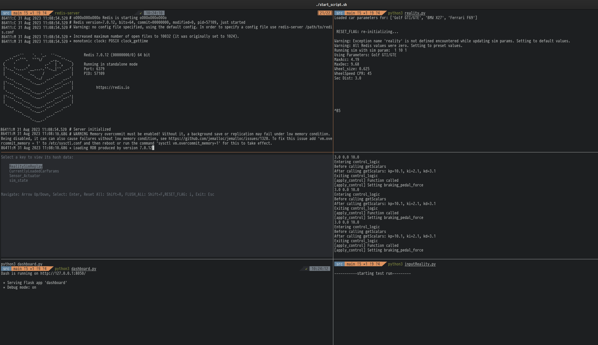
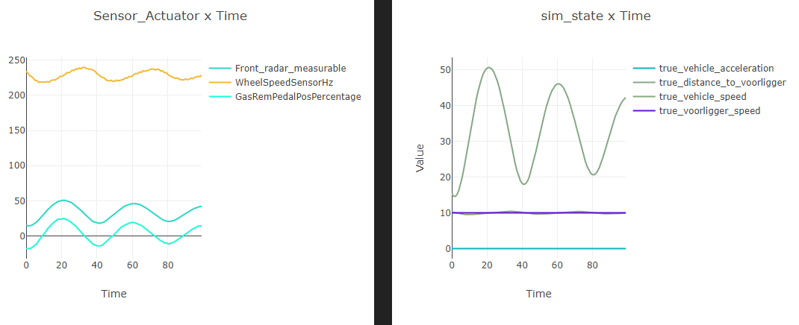

# finnff ATP Bezem 22/23

# Project- en Testplan

* zie /projectTestPlan/

# Eindopdracht Testrapport
zie hiervoor [tests/README.md](https://github.com/finnff/ATP2022/blob/main/tests/README.md)

---

# Eindopdracht

## Requirements:

* redis-server
* tmux voor startscript (maar anders in de volgorde van ./src/start_script.sh elke python file openen werkt ook)

## Uitleg per file:

#### src/CarParamsManager.py

Is verantwoordelijk voor het laden van de car parameters (zie ./car_constants/) in redis, en zorgt ervoor dat we van auto kunnen verwisselen.

#### src/combined_interface.py

Dit is de interface waar de FRP cpu voornamelijk mee interacteerd, hier binnnen is het nog een wrapper functie voor de twee actuators en zowel de speedSensor, radar sensor en het gas + rem pedaal

#### src/dashboard.py

Een Flask / plotly / dash live dashboard, waarmee we de huidige waardes + kunnen laten zien 

#### src/frpCPU.py

De functional reactive python geprogrameerde CPU, die de PID/BangBang controller aanstuurt (door define boven aan file), hier naast is er ook 2 aspect oriented wrappers (en een die naar file logged: hieruit leest dashboard (via combined_interface) weer interne waardes van FRP/pid uit)

#### src/inputReality.py

Deze file zorgt er voor dat we inputs kunnen geven aan de simulator, en custom testcases kunnen maken / automatisch genereren en runnen. deze zet ook de RESET_FLAG en CRASHED_FLAG zodat we meerdere runs kunnen doen.

#### src/reality.py

Hoofd deel van de siumlator: deze bevat de update loops, expirimentele time scaling ( versnellen/vertragen werkt niet echt goed omdat de FRP observables interval hiermee zou moeten mee scalen dus staat op realtime) en simuleert de werkelijkheid en dus ook abstracties van de frontRadarSensor en de WheelSpeedsensor. 

#### src/WheelSpeedCPP/ 

Python Binding naar C++, reader.py is een demo qua usecase, combined_interface gebruikt direct de binary .SO file.  de code voor het maken hiervan is gedaan met Pybind11, de implemtatie staat in ./WheelSpeedCPP/aaaa/aaaa.cpp, om te builden heb je wel de `usr/lib64/libhiredis.so` en `usr/include/hiredis/hiredis.h` nodig (download via package manager en pas zo nodig de cmake paths aan) om dat de C++ binding na het ontvangen van CPR en Diameter setters data leest van Redis , en deze vervolgens ge Get() kan worden. Voor meer info zie de README van /tests/

####  Redis controller './redis-memory-remote'

Redis is een RAM based key-value store dat we gebruiken voor inter-process communication in onze simulator Regelsysteem. (Websockets was te langzaam/onstabiel)

Alle data is opgeslagen in RAM voor snelle read write performance, maar Redis heeft persistence features, dus deze data wordt gesaved naar Harddrive blijft bestaan na sluiten applicatie of na reboots. Hiervoor heb ik een Tool gemaakt:

#### Usage:

1. `chmod +x redis-memory-remote`
2. `./redis-memory-remote`

- **View Data**: Interactive UI to browse Redis keys, use `arrow keys, Enter and Esc`
- **Reset Data**: Reset keys to default values. `Shift+R` or from cli:  `./redis-memory-remote -R`
- **Flush Data**: (__Unstable!__) Remove all data from Redis. `Shift+F` or from cli:  `./redis-memory-remote -F`

Note: Flush (basically SQL Droptable) heeft nogal de neiging om raceconditions en crashes te veroorzaken zeker voor de C++ binding dus het is meestal voldoende om tijdens runnen aleen te reseten naar default Waardes voor de simulator/testing 

