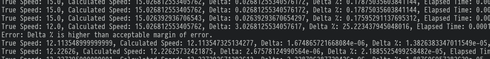

# TestRapport


# Unit Test 1  Measures Speed calculator  (./src/WheelSpeedCPP/wsp_mod.so) bestaande uit  (./src/WheelSpeedCPP/aaaa/aaaa.cpp)


## Unit Test: MeasuredSpeedCalculator

### Motivatie
De MeasuredSpeedCalculator is een cruciaal onderdeel van het systeem, aangezien het de snelheid van het voertuig probeert
te berekenen op basis van de input van de WheelSpeedSensor. 
 Een nauwkeurige snelheidsberekening is essentieel voor het ACC systeem, waardoor het op een veilige afstand tot het voorliggende voertuig kan blijven. 
  Als de MeasuredSpeedCalculator onjuiste snelheden berekent, heeft dit via de CPU invloed op het op het GasPedaal en Remsysteem. Fouten of ongewenst gedrag in deze 2 actuatoren
   kan dit leiden tot onveilige situaties en mogelijk ongevallen. Het testen van deze component is daarom noodzakelijk
   om te waarborgen dat het systeem goed functioneert en om de veiligheid te garanderen.

     
### Testprocedure 

Testen of de MeasuredSpeedCalculator de snelheid van het voertuig correct berekent op basis van verschillende inputwaarden(Hatchback,SUV,Ferrari) van de WheelSpeedSensor, Wieldiameter en CPR van het encoderwiel.

1. Bereid testscenario's voor met verschillende inputwaarden voor de WheelSpeedSensor, Wieldiameter en CPR van het encoderwiel. Gebruik realistische waarden die overeenkomen met verschillende voertuigtypen (bijv. Hatchback, SUV, Ferrari).
2. Voer de testscenario's uit met behulp van de Simulator, en leg zowel de berekende snelheden, als de TrueVehicleSpeed uit de Simulator vast.
3. Vergelijk de berekende snelheden met de TrueVehicleSpeed, rekening houdend met de variabelen van de verschillende soorten autos uit de testscenario's. 
4. Controleer of de berekende snelheden binnen een acceptabele foutmarge(+- 2.0%) van de verwachte snelheden vallen. Als dit niet het geval is, onderzoek dan de oorzaak en pas de implementatie van de MeasuredSpeedCalculator (of WheelSpeedSensor) aan indien nodig.
5. Herhaal de testprocedure totdat de berekende snelheden consistent nauwkeurig(i.e. binnen de foutmarge) zijn voor alle testscenario's.


Deze testprocedure is ontworpen met verschillende belangrijke aspecten in gedachten om de nauwkeurigheid van de snelheidsberekeningen te waarborgen en de veiligheid van het systeem te garanderen:

- Realistische waarden worden gebruikt voor de inputvariabelen om de prestaties van het systeem in de praktijk te beoordelen.
- Het vastleggen van zowel de berekende snelheden als de TrueVehicleSpeed stelt ons in staat om objectief de nauwkeurigheid van de berekeningen te beoordelen.
- Door een kleine foutmarge te gebruiken, wordt rekening gehouden met de beperkingen van floating-point precisie en kleine nauwkeurigheidsfouten in de sensors.
- Het herhalen van de testprocedure zorgt voor betrouwbaarheid en verkleint de kans op onveilige situaties of ongevallen.

Door deze testprocedure te volgen, kunnen we de nauwkeurigheid van de snelheidsberekening garanderen en voorkomen dat ongewenst gedrag van het GasPedaal en Remsysteem leidt tot onveilige situaties en mogelijk ongevallen.


De Measuresed Speed snso werkt voor alle sorten wielen, ook bij bewegeing , hoewel in eerste we de foutmarge wel haal maar dat er nog wel relatief veel foutmarge zit in het lezenv van de sensor:

##########


```json
{
    "Param Name": "Ferrari F69",
    "Wheel Diameter": 0.71,
    "Encoder CPR": 40,
    "Param Name": "Golf GTI/GTE",
    "Wheel Diameter": 0.625,
    "Encoder CPR": 45,
    "Param Name": "BMW X27",
    "Wheel Diameter": 0.838,
    "Encoder CPR": 60,
}
```

De Measured Speed sensor is ontworpen om compatibel te zijn met verschillende soorten wielen en bewegingsomstandigheden. Uit de eerste testresultaten blijkt dat we binnen de gespecificeerde foutmarge van ±2.0% vallen. Hier zijn enkele voorbeeldresultaten:

- True Speed: 12.03, Calculated Speed: 11.99, Delta: 0.04, Delta %: 0.30%
  
Hoewel we binnen de foutmarge zitten, is het belangrijk op te merken dat we een interne fout van 0.3% hebben gemodelleerd voor de sensor, zoals aangegeven op pagina 17 van de [Infineon-TLE5041PLUSC datasheet](https://www.infineon.com/dgdl/Infineon-TLE5041PLUSC-DataSheet-v01_02-EN.pdf?fileId=5546d46265f064ff016632437f574f75).

Hij is getest met de volgende 3 Autos:


```json
{
    "Param Name": "Ferrari F69",
    "Wheel Diameter": 0.71,
    "Encoder CPR": 40,

    "Param Name": "Golf GTI/GTE",
    "Wheel Diameter": 0.625,
    "Encoder CPR": 45,

    "Param Name": "BMW X27",
    "Wheel Diameter": 0.838,
    "Encoder CPR": 60,
}
```


De enige fouten die ik ben tegen gekomen gebeurden als ik handmatig (via de simulator) de snelheid van het voertuig ging veranderen, en dat de berekening van de oude snelheid al was gestart (Multi threaded concurreny ):




```python
# Code voor het toevoegen van een willekeurige fout van ± 0.3% zoals gespecificeerd in de datasheet.
encoder_pulses_per_second *= 1 + random.choice([-0.003, 0.003])
````


Wanneer deze sensorfout wordt verwijderd uit de simulatie, zijn de foutmarges extreem laag, wat betekend dat onze code en C++-binding zeer nauwkeurig zijn in het berekenen van de snelheid, ongeacht het voertuigtype en de wielgrootte.

```
True Speed: 12.300423,          Calculated Speed: 12.30042076110839, Delta: 2.2388916018911686e-06, Delta %: 1.820174478464008e-05, Elapsed Time: 0.00011110305786132812, 1/Elapsed Time: 9000.652360515021
True Speed: 12.410620000000002, Calculated Speed: 12.41061782836914, Delta: 2.1716308609143198e-06, Delta %: 1.749816577184959e-05, Elapsed Time: 0.0001347064971923828,  1/Elapsed Time: 7423.546902654867
True Speed: 12.519560000000002, Calculated Speed: 12.51955795288086, Delta: 2.047119142645215e-06,  Delta %: 1.63513665228268e-05,  Elapsed Time: 0.0001900196075439453,  1/Elapsed Time: 5262.614805520702
```
Dit suggereert dat het merendeel van de geobserveerde fout waarschijnlijk toe te schrijven is aan de sensor zelf en niet aan mijn implementatie van WheelSpeedSensor. Het enige andere type fout dat aanwezig is, betreft minimale verschillen veroorzaakt door het omzetten van floating-point getallen naar Integers. 


## Integratietest: WheelSpeedSensor's industriele 12V Current Modulation interface

### Motivatie

*De communicatie tussen de WheelSpeedSensor en de MeasuredSpeedCalculator is noodzakelijk voor het berekenen van de snelheidsberekeningen.*
*Als deze interface niet goed werkt, levert dit misschien onjuiste data voor de MeasuredSpeedCalculator. Dit zal problemen opleveren voor de hierboven genoemde Unit Test.*
*Het testen van de interface helpt om te waarborgen dat het systeem correct functioneert en draagt bij aan de veiligheid.*
*Test: Testen of de 12V Current Modulation-interface de High/Low current outputs van de WheelSpeedSensor correct doorstuurt naar de MeasuredSpeedCalculator en of de MeasuredSpeedCalculator deze signalen correct interpreteert om de snelheid van het voertuig te berekenen.*

*### Testprocedure*

*- Zorg ervoor dat de WheelSpeedSensor en de MeasuredSpeedCalculator correct zijn aangesloten via de 12V Current Modulation-interface. (In ons geval is dit de C++/Python Bindings en de communicatie hiertussen)*
*- Simuleer verschillende rotatiesnelheden van het wiel, met de WheelSpeedSensor daarop aangesloten.*
*- Monitor de High/Low current outputs die door de WheelSpeedSensor worden gegenereerd op basis van de rotatiesnelheid van het wiel en verifieer of deze correct worden doorgegeven via de 12V Current Modulation-interface.*
*- Controleer of de MeasuredSpeedCalculator de ontvangen High/Low current outputs correct interpreteert en of de berekende snelheid overeenkomt met de werkelijke snelheid van het wiel (rekening houdend met de wieldiameter en de CPR van het encoderwiel).*
*- Voer deze test uit voor verschillende rotatiesnelheden van het wiel om te verifiëren of de interface en de MeasuredSpeedCalculator onder verschillende omstandigheden correct functioneert.*

*De testprocedure controleert of de 12V Current Modulation-interface correct werkt en of de MeasuredSpeedCalculator de signalen nauwkeurig interpreteert. Hierdoor wordt de nauwkeurige snelheidsberekening gegarandeerd en de veiligheid van het systeem gewaarborgd. Het testen van verschillende rotatiesnelheden zorgt ervoor dat het systeem onder uiteenlopende omstandigheden correct functioneert.*


dat de unit test hierboven voor zoon goed werkt is niet voor niets: oorspronkelijk hadden we wel 
